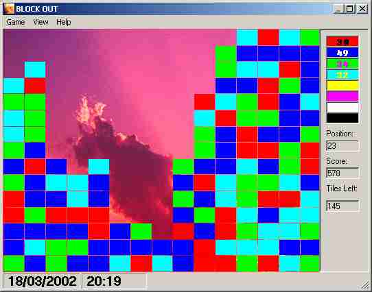



## Block Out

### Description

This is an ultra addictive game - don't just take my word for it - try it i haven't seen anything on PSC like this before! The source has next to no comments but is still easily readable. This was a spare time project I was playing with years ago. Just found the code and thought it is perfect for submitting to PSC. I will be updating this game with more features soon. The concept of the game is simple. Infact you will most likely recognise it as a hybrid of other versions. This one has a unique scoring feature though - that I haven't seen before. Please Vote for this - this is my first submission. Read the help box for the simplest of instructions. Adapt the code but remember me OR give me your suggestions to update it! Next version I aim to use more animation and directX.

Remember VOTE VOTE VOTE.

Ps Anyone got a license they can GIVE ME for the latest MSDN? ;-) mines old and out of date! :-(     Hey, I am noticing that a lot of people leach code but cannot be bothered to click on them rating buttons at the bottom. Support PSC and others by voting for peoples efforts it takes seconds to do!!!!
 
### More Info
 
One side effect is amnesia - You'll not know where the time went after playing it!!!

             |
---                |---
**Submitted On**   |2002-03-18 13:15:48
**By**             |[Sie](https://github.com/Planet-Source-Code/PSCIndex/blob/master/ByAuthor/sie.md)
**Level**          |Intermediate
**User Rating**    |4.9 (69 globes from 14 users)
**Compatibility**  |VB 5\.0, VB 6\.0
**Category**       |[Games](https://github.com/Planet-Source-Code/PSCIndex/blob/master/ByCategory/games__1-38.md)
**World**          |[Visual Basic](https://github.com/Planet-Source-Code/PSCIndex/blob/master/ByWorld/visual-basic.md)
**Archive File**   |[Block\_Out631453182002\.zip](https://github.com/Planet-Source-Code/sie-block-out__1-32783/archive/master.zip)

